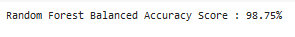
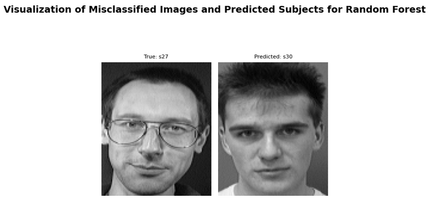
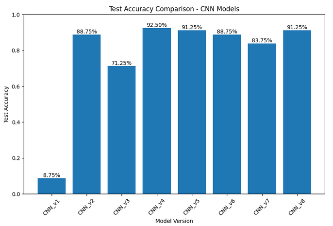
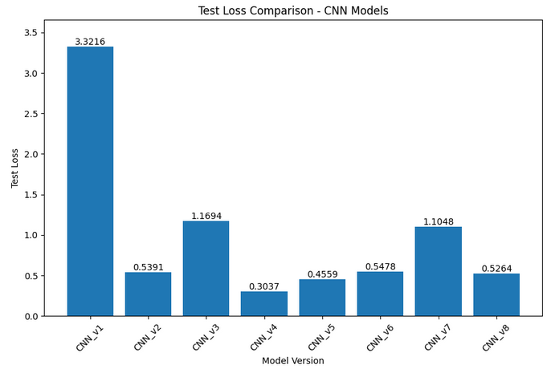
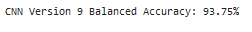
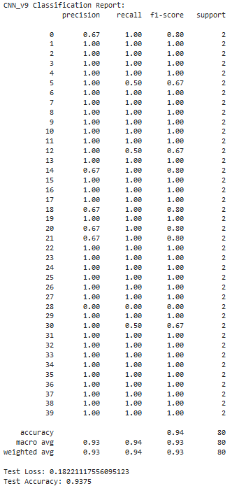
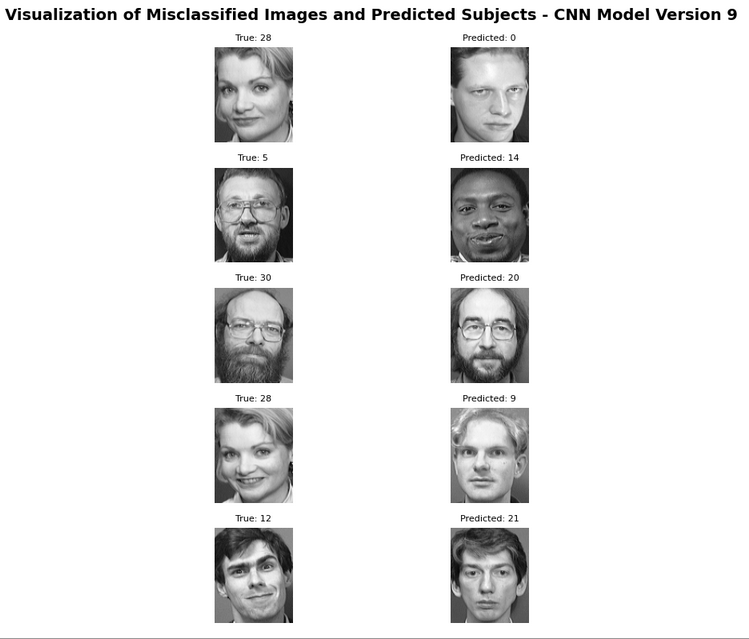
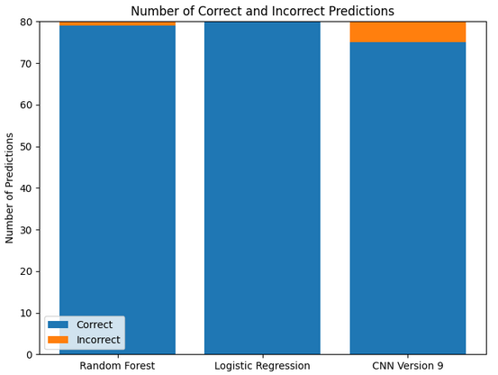
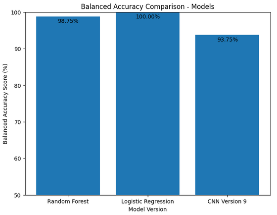

# AT&T/Olivetti Facial Recognition with Machine Learning and Deep Learning

**Group 4: Lisa Drain, Shoaib Farooqui, Dominic Marin, Francisco Latimer**

Facial recognition can be useful in practically any industry for security, verification, or VIP treatment purposes. This project's primary objective is accurately identify the subject in an image from the [ATT Database of Faces](https://www.kaggle.com/datasets/kasikrit/att-database-of-faces) dataset(ORL Database of Faces). The dataset consists of 40 individuals each with 10 images.

This Python script experiments with three different models (Random Forest, Logistic Regression, and CNN) to asses their suitability, performance, and potential for real-world application. While Random Forest and Logistic Regression employ traditional machine learning algorithms, CNN's deep learning architecture is specifically designed for image-related tasks. By comparing these three models, we hope to gain a better understanding of the capabilities of machine learning and deep learning in the field of facial recogntion.

### Dependencies

* os
* zipfile
* numpy
* matplotlib
* pandas
* PIL (Python Imaging Library)
* sklearn
* collections
* tensorflow
* keras

### Loading the Data

The data is extracted from a zip file named Faces.zip, converted to grayscale, and stored in a list with corresponding labels. The images are also encoded into a vector representation for easier processing and analysis. The original format is saved off for a 2d array for the CNN model and a flattened 1d array is saved off for the machine learning models.

### Exploratory Data Analysis

The entire dataset is visualized. Then a selected individual's set can be defined and displayed (this was very useful while developing the code as a reference point).

### Machine Learning Models

Using the sklearn library, the data is split into training and test sets. A random seed `<random_state=1>` was selected across all three models to ensure reproducibility and to provide more valid and consistent comparison of their performance. Stratification was used to maintain the same distribution of classes in both training and testing sets. And a testing size of 20% was applied across all models enabling fair evaluation of each model's performance. For Logistic Regression, the data is first scaled using `<'MinMaxScaler'>`.

#### 
    Random Forest Classifier

The Random Forest model demonstrates high precision, recall, and F1-scores for most classes (40 individuals), indicating its ability to correctly classify images of different individuals. The weighted average values show that the model's performance is consistent across all classes, considering the support values (2 images for each individual). The overall accuracy of 95% indicates the model's strong classification capability.

#### 
    Logistic Regression Model

The Logistic Regression model has high accuracy, sensitivity, and specificity in correctly identifying individuals from their images, making it highly reliable for facial recognition tasks in this dataset.

### CNN Models

The images are reshaped and normalized, and the labels are one-hot encoded. The CNN model is then compiled using the keras library and fit to the training data. The model's accuracy is then evaluated on the test data. Through an optimization process, each model version is saved individually to show iterative changes made to the model and the performance.

#### CNN Model Version 9

CNN Version 9 model has three convolutional layers (extracting relevant features from the images), uses a 3x3 kernel and the ReLU activation function. The number of filters is set to 32 each of the three layers and the 'he_uniform' kernel initializer is used to initialize the weights. After each layer, a max poolying layer with a 2x2 pool size is applied, which helps reduce the spatial dimensions of the extracted features so the most important information can be focused on. The output of the last max pooling layer flattens into a 1d vector. These flattened features are fed into two dense layers. The first dense layer consists of 256 neurons and the second dense layer consists of 128 neurons with the ReLU activation function and 'he_uniform' kernel initializer. The final dense layer consists of 40 neurons with the softmax activation funcation to produce probabilities for each of the 40 individuals. The model is compiled using the Adam optimizer, categorical cross-entropy loss funcation, and accuracy as the evaluation metric.

In terms of performance, the CNN Version 9 model demonstrates reasonable performance, but further investigation and fine-tuning would be needed to improve its accuracy and performance on specific classes with lower scores. 

### Comparative Visualizations

### Conclusions

Our results revealed that Logistic Regression achieved the highest performance, with an impressive accuracy of 100%. This model demonstrated excellent precision, recall, and F1-scores, indicating its reliability in correctly classifying images across different individuals. Logistic Regression can be considered a strong choice for facial recognition tasks in this dataset.

The Random Forest model also exhibited excellent performance, achieving an accuracy of 98.75%. It demonstrated high precision, recall, and F1-scores for most classes, further validating its effectiveness in correctly identifying individuals from their images. Random Forest can be considered a robust alternative for facial recognition, especially when dealing with complex feature interactions.

Although the CNN model achieved a lower accuracy of 93.75%, it still demonstrated reasonable performance. The CNN architecture, specifically designed for image-related tasks, extracted relevant features from the images and learned spatial dependencies. However, the smaller dataset size of 400 images may have limited the model's ability to learn complex patterns, leading to slightly lower accuracy. Further investigation and fine-tuning would be needed to improve its accuracy and performance, particularly on classes with lower scores.

The findings of this project highlight the strengths of Logistic Regression and Random Forest models for facial recognition tasks, showcasing their high accuracy and reliability. Moreover, the exploration of the CNN model provides valuable insights into the potential of deep learning approaches for image recognition, although with some considerations for dataset size.

### PySpark

Based on an early hypothesis that there could be a correlation between misclassification and pixel intensity, the average pixel intensity for each subject's set of 10 images was calculated. A correlation was not found. However, this information was loaded into PySpark (primarily to satisfy part of a grading rubric for this project) and it is possible that with some additional digging and loading of data some relevant information could be retrieved for further exploration. 

### References

[Using Random Forests for Face Recognition](https://notebook.community/mbeyeler/opencv-machine-learning/notebooks/10.03-Using-Random-Forests-for-Face-Recognition)

The above link contains an excerpt from the book [Machine Learning for OpenCV](https://www.packtpub.com/big-data-and-business-intelligence/machine-learning-opencv) by Michael Beyeler. While the Random Forest Classifier model in the script referenced in this ReadMe does not utilize CV, using Random Forest for this solution was inspired by the link.

[What is MNIST? And why is it important? by SelectStar at medium.com](https://selectstar-ai.medium.com/what-is-mnist-and-why-is-it-important-e9a269edbad5)

The initial CNN model in this script pulls directly from the code and walkthrough in this article, though the initial accuracy was very low (8.75%) prior to optimization.
